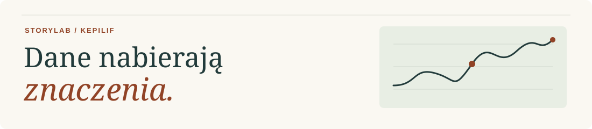

# Kepilif

**Data Analysis · Data Engineering · Data Storytelling**

Łączę pozyskiwanie i przetwarzanie danych, analizę oraz komunikację wyników. Buduję projekty obejmujące cały przepływ — od źródeł i przygotowania danych, przez SQL/Python i modelowanie, po wizualizację oraz publikację odtwarzalnych raportów.

Rozwijam **StoryLab** — portfolio historii o klientach, sporcie, gospodarce i klimacie. W raportach pokazuję źródła, metody, wnioski oraz ograniczenia interpretacji.

**[Zobacz portfolio StoryLab →](https://kepilif.github.io/storylab/)** · [Kod i źródła](https://github.com/Kepilif/storylab)

## Wybrane projekty

- **[Smart Garden Data Pipeline](https://github.com/Kepilif/smart_garden_project)** — pomiary z czujników przez MQTT i Python do PostgreSQL; dashboard Django/Chart.js oraz moduł prognozowania temperatury. Projekt rozwijany iteracyjnie.
- **[Home Assistant Warehouse](https://github.com/Kepilif/smart_garden_project/tree/main/ha_warehouse)** — cykliczny import z REST API do PostgreSQL, uzupełnianie danych historycznych, deduplikacja oraz widoki SQL do kontroli jakości i porównywania pomiarów z prognozami pogody.
- **[Segmentacja klientów e-commerce](https://kepilif.github.io/storylab/stories/ecommerce_segmentation/)** — analiza zachowań zakupowych, RFM, KMeans i reguły koszykowe. Od danych do hipotez marketingowych.
- **[NBA Scouting Patterns](https://kepilif.github.io/storylab/stories/nba_scouting_patterns/)** — profile zawodników, wiek, pochodzenie i statystyki sezonowe. Eksploracja z jawnymi ograniczeniami danych.
- **[Temperatura — prognoza i rzeczywistość](https://kepilif.github.io/storylab/stories/globalne_ocieplenie/)** — szeregi czasowe FAOSTAT i Copernicus, benchmarki oraz ocena prognoz ARIMA i SARIMA.
- **[Polski dług publiczny](https://kepilif.github.io/storylab/stories/public_debt_storytelling/article/polski_dlug_publiczny_story.html)** — porównanie miar PDP i EDP oraz interpretacja zmian zadłużenia w zapisanych danych z lat 2001–2025.

## Warsztat

- **Data:** Python, SQL, pandas, NumPy
- **Data Engineering:** ETL, pipeline’y danych, PostgreSQL, REST API, MQTT
- **Modelowanie:** scikit-learn, statsmodels
- **Wizualizacja:** Matplotlib, Plotly, Tableau
- **Workflow:** Git, Jupyter, Quarto

Zaczynam od pytania i jakości danych. Wyniki łączę z kontekstem, a obserwacje oddzielam od hipotez. Portfolio rozwijam iteracyjnie; zakres danych i etap projektu opisuję w raportach.

## Kontakt

[E-mail](mailto:jacek.filipek@gmail.com) · [LinkedIn](https://www.linkedin.com/in/kepilif/) · [Tableau Public](https://public.tableau.com/app/profile/jacek.filipek/) · [GitLab](https://gitlab.com/kepilif/)
